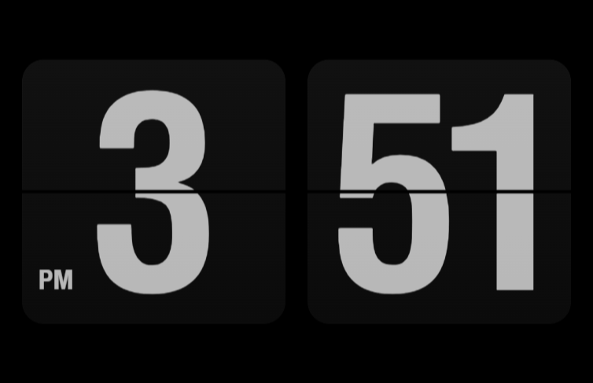

# Fliqlo (Offline Edition)

> **100% Offline Flip Clock Screensaver for Windows**  
> Полностью автономная заставка «Перекидные часы» (Flip Clock) для Windows без зависимости от интернета и без телеметрии.




---

## 📌 О форке и источнике / Fork Information

* **Оригинал / Original Project:** [Fliqlo Screensaver](https://fliqlo.com/) by **Yuji Adachi** ([9031.com](https://9031.com/))
* **Базовая версия:** Fliqlo for Windows v1.5.1 (март 2021)
* **Автор форка:** [andreysdsgroup](https://github.com/andreysdsgroup)

---

## 🔍 Какую проблему решает этот форк / Background & Motivation

В оригинальной версии Fliqlo 1.5.1 для Windows:
1. **Жесткая зависимость от интернета:** сама заставка представляет собой оболочку (.NET WinForms / WebBrowser), которая загружала веб-страницу часов с удалённого сервера `https://fliqlo.app/`.
2. **Блокировка без сети:** перед запуском в C#-коде стояла искусственная проверка `NetworkInterface.GetIsNetworkAvailable()`. Если компьютер не был подключен к интернету, часы даже не пытались запускаться — отображался черный экран или большой серый восклицательный знак (`Resources.error` с подсказкой *"No Internet Connection"*).
3. **Сторонняя телеметрия:** в страницу был встроен скрипт счетчика Google Tag Manager (`G-YC1T5FXJG3`).
4. **Проверка домена:** в JavaScript была зашита проверка домена `window.location.hostname.indexOf("fliqlo.app") >= 0`, из-за чего страницу нельзя было просто открыть из локального файла.

При этом сами часы (переворот пластин, 12/24 формат, расчет времени) работали на локальном JavaScript и брали системное время компьютера через `new Date()`. Требование сети было исключительно искусственным ограничением.

---

## ✨ Что сделано в этой версии / Improvements

* ✅ **100% Offline:** Все ресурсы (HTML-разметка, стили CSS3 3D-анимации, JavaScript-логика и фирменные шрифты `.woff` / `.ttf` / `.eot`) встроены прямо в бинарный файл заставки в виде байтовых массивов в оперативной памяти.
* ✅ **Встроенный локальный микро-сервер:** В процесс заставки встроен легковесный `LocalServer` на базе `HttpListener` (`127.0.0.1`), который отдаёт ресурсы прямо из ОЗУ. Это обходит ограничения безопасности локальной зоны IE (`file://`) для веб-шрифтов `@font-face` без необходимости создавать временные файлы на диске.
* ✅ **Удален весь трекинг и мусор:** Вырезаны счетчики Google Tag Manager/Analytics и сетевые проверки.
* ✅ **Убраны ограничения домена:** Скрипты модифицированы для безоговорочной работы в локальном режиме.
* ✅ **Нативное системное время:** Время берется напрямую из локальной операционной системы Windows.
* ✅ **Поддержка нескольких мониторов:** Заставка корректно растягивается на все подключенные экраны, как и оригинал.
* ✅ **Панель настроек (`/c`):** Поддерживается переключение 12/24-часового формата, масштабирование (размер часов) и регулятор яркости.

---

## 🚀 Установка / Installation

1. Скачайте или соберите `Fliqlo.scr`.
2. Щелкните правой кнопкой мыши по файлу `Fliqlo.scr` и выберите **«Установить»** (Install).
3. Либо скопируйте файл в `C:\Users\%USERNAME%\AppData\Local\Programs\Fliqlo\Fliqlo.scr` и укажите его в настройках заставки Windows (Screen Saver Settings).

---

## 🛠 Сборка из исходников / Build from Source

Требования: Windows 10/11, установленный .NET SDK или Visual Studio / MSBuild.

### Быстрая сборка через командную строку (One-click build):
```cmd
build.bat
```
Скрипт автоматически найдет компилятор Roslyn `csc.exe` и соберет готовый `Fliqlo.scr`.

### Либо через .NET CLI:
```cmd
dotnet build Fliqlo.csproj -c Release
```

---

## 📄 Лицензия и копирайты / License & Credits

* Дизайн, концепт и фирменный перекидной шрифт принадлежат **Yuji Adachi** ([9031.com](https://9031.com/) / [fliqlo.com](https://fliqlo.com/)).
* Данный форк создан в образовательных целях для обеспечения работоспособности заставки в оффлайн-режиме и автономных системах.
* Код форка распространяется под лицензией MIT.
